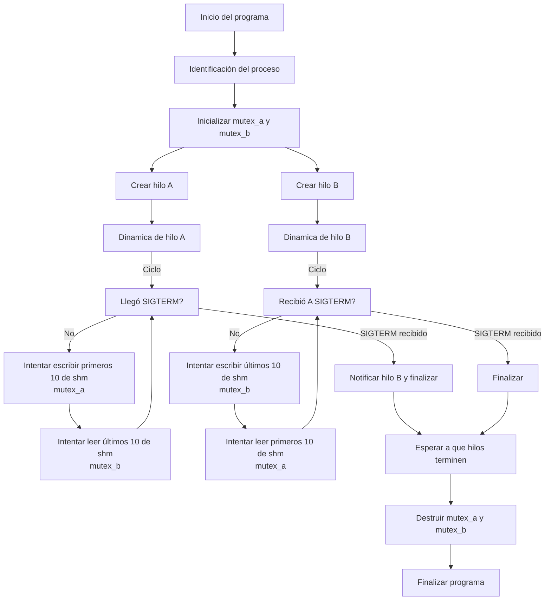
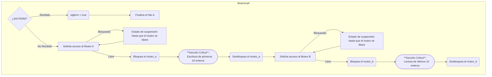

# Entregable Practica 3

### Scatena, Adriano 74725/9

### Rolandelli, Lautaro 74366/5

## Indice

1. [Consigna](#consigna)
2. [Problemática](#problemática)
3. [Resolución](#resolución)
4. [Diagrama de Flujo](#diagrama-de-flujo)
5. [Modo de uso](#modo-de-uso)
6. [Bibliografía](#bibliografia)

## Consigna

Escriba un programa que utilice un arreglo de 20 `int`, compartido entre dos hilos A y B de manera tal que A escriba los primeros 10, y B los lea solamente después que se completó la escritura. De la misma manera B escribirá los 10 últimos enteros del arreglo y A los leerá solamente después que B complete la escritura. Este proceso se repetirá hasta que el hilo A reciba la señal `SIGTERM`, y cuando la reciba debe a su vez hacer terminar el hilo B, y liberar todos los recursos compartidos utilizados.
Los datos serán números entre 0 y 26, (representando letras entre la a y la z), que serán cifrados previo a la escritura mediante una función de cifrado de la forma $𝑓(𝑥) = (𝑎𝑥 + 𝑏)\cdot𝑚𝑜𝑑\;𝑛$. En donde (a,b) serán claves públicas que estarán disponibles en memoria compartida. Para el descifrado de los datos se usará la función inversa $𝑓^{-1}(𝑥) = (𝑘𝑥 + 𝑐)\cdot𝑚𝑜𝑑\, 𝑛$, en donde $(k,c)$ son claves privadas conocidas solo por el proceso lector. Como función de cifrado se usará $𝑓(𝑥) = (4𝑥 + 5)\cdot 𝑚𝑜𝑑\;27$ y para el descifrado $𝑓^{-1} (𝑥) = (7𝑥 + 19)\cdot 𝑚𝑜𝑑\;27$.
Ambos hilos realizarán primero la escritura de los datos en la zona correspondiente y luego la lectura. **_Ninguno de los dos hilos puede escribir en su zona hasta que el otro no haya leído los datos, excepto la primera vez_**. La escritura en ambos casos se realizará a razón de un valor por segundo, mientras que la lectura se realizará tan rápido como se pueda y se imprimirá en pantalla junto con la identificación del hilo que está leyendo.
El programa debe ser **único**, es decir el mismo programa debe implementar el hilo A y el hilo B. Realice su implementación basada en variables compartidas y mutex.

## Problemática

#### Objetivo:

_Diseñar un programa que implemente dos hilos, A y B, y su respectiva correcta y ordenada sincronización para escribir y leer de manera controlada un arreglo compartido de 20 enteros. Incluir las restricciones pertinentes para el acceso a las zonas del arreglo, de manera que se garantice que cada hilo lea solo después de que el otro haya completado su escritura. Incorporara la correcta dinámica de cifrado y descifrado de los datos, utilizando funciones modulares. Implementar la finalización de los hilos el proceso cuando el hilo A reciba una señal `SIGTERM`, lo que también detendrá al hilo B y liberará los recursos compartidos. Utilizar convenientemente los recursos de los hilos y `mutex` para la ejecución del objetivo del programa_

## Resolución

Para la resolución del presente trabajo, se empleó como recurso principal para la sincronización de la actividad de los hilos la herramienta `mutex` (_"Mutual Exclusion"_), que se utiliza frecuentemente en programación concurrente ya que permite garantizar que solo un hilo tenga acceso a una sección crítica en un momento dado. Es importante su correcta implementación para así poder evitar condiciones de carrera en la escritura/lectura del arreglo compartido, ya que ambos hilos intentan acceder y/o modificar datos al mismo tiempo en el mismo. De esta manera el `mutex` bloquea el acceso a un recurso mientras un hilo lo está usando, y solo el hilo que lo ha bloqueado puede liberarlo.
La estrategia empleada se basa en administrar el acceso a la sección crítica de cada hilo de manera tal que cuando este desea acceder a la misma, primero intenta bloquear el `mutex`. Si el `mutex` está desbloqueado, el hilo lo "adquiere" y procede con la ejecución de la sección crítica. En este momento, el mutex está bloqueado para cualquier otro hilo, impidiendo que otro hilo acceda al recurso en modificación. Sabiendo que si otro hilo intenta bloquear el `mutex` cuando este ya fue bloqueado, pasa a un estado de "bloqueo" a **_nivel de sistema operativo_** (llamado también como **_bloqueo de sincronización_**), es decir ingresa a un estado de suspensión y es el propio sistema operativo quien lo pone en "espera" (de manera tal que no se consuman recursos del CPU). La espera sucede hasta que el hilo que posee el `mutex` lo libere. Por ello es fundamental que, una vez que el hilo termina su actividad en la sección crítica, desbloquea el mutex, permitiendo que el otro hilo pueda acceder a la propia sección crítica. Esto se puede ver evidenciado en el código del programa en las dinámicas designadas para cada hilo, donde se incluyen las funciones `pthread_mutex_lock()` (para bloquear el `mutex`), y `pthread_mutex_unlock()` (par desbloquearlo). Véase como ejemplo la dinámica del **hilo A** con la sección critica de escritura del bloque compartido:

```C
    pthread_mutex_lock(&mutex_a);

    printf("\n\033[0;32mHilo A\033[0m comenzo a escribir los primeros 10 elementos\n\n");
    sleep(2);
    /* SECCIÓN CRITICA */
    for (int i = 0; i < SIZE / 2; i++) {
        int rnum = rand() % 27;
        shm.datos[i] = cifrar(rnum);
        printf("\033[0;32mHilo A\033[0m Escribio \033[0;36m%d\033[0m (C: %d), en shm.\033[0;32mdatos[\033[0;32m%d\033[0m\033[0;32m]\033\n", rnum,
                shm.datos[i], i);
        sleep(1);
    }
    /* FIN SECCIÓN CRITICA */

    pthread_mutex_unlock(&mutex_a);

```

Esta estrategia asegura que, aunque ambos hilos estén ejecutándose en paralelo, solo uno puede modificar o leer el recurso compartido, lo cual garantiza la coherencia de los datos para ambos hilos. Sin el mutex, los hilos podrían interferir entre sí, lo que llevaría a condiciones de carrera y resultados incorrectos.

La finalización del programa se realiza mediante la recepción e interrupción de la señal `SIGTERM` al _hilo A_, ya que este tiene declarado el manejador de la señal:

```C
    signal(SIGTERM, handle_sigterm);
```

En la rutina del propio manejador, se establece en `true` la _flag_ `sigterm`, de manera tal que, ya que se trata de un proceso multihilos, y que el entorno del proceso se comparte, o pertenece, a cada uno de los hilos, la misma _flag_ es leida por ambos hilos, los cuales se dedican a finalizar su rutina saliendo de la estructura condicional `while(!sigterm){...}` y llamando a la función `pthread_exit(NULL)`. Véase el manejador a continuación:

```C
void handle_sigterm(int signum) {
    sigterm = true;
    printf("\n\033[0;32mHilo A\033[0m detectó SIGTERM. Notificando a hilo B y finalizando luego de completar tareas...\n\n");
}
```

Finalizado cada hilo, el proceso principal espera la finalización de cada uno de ellos ya que se emplea la función `pthread_join()`, la cual a nivel proceso dicta la espera del mismo hasta que dicho hilo termine. Esto garantiza que el proceso principal no termine antes de que los hilos hayan finalizado su ejecución. Luego se liberan los recursos de los _mutexes_ con `pthread_mutex_destroy()` y se retorna el valor de éxito (0) si todo finaliza correctamente. Véase dicha rutina:

```C
    // Espera a que los hilos terminen su ejecucion.
    pthread_join(hiloA, NULL);
    pthread_join(hiloB, NULL);

    // Liberar recursos
    pthread_mutex_destroy(&mutex_a);
    if (errno == EBUSY)
        perror("mutex_a");
    pthread_mutex_destroy(&mutex_b);
    if (errno == EBUSY)
        perror("mutex_b");

    printf("\n Hilos destruidos.\n");

    printf("\nFinalizando programa...\n");
    return 0;
```

## Diagrama de Flujo


En especifico, las dinamicas de los hilos se comportan de manera idéntica. Ejemplificando con el hilo A, se obtiene:



## Modo de Uso

Para la ejecución del programa principal debe primero compilarse el archivo _.c_ que contiene el script del propio ejercicio. Para ello debe ejecutarse mediante la terminal de _bash_ el compilador de C del proyecto GNU `gcc`, generando un archivo ejecutable (o archivo de objeto).

```bash
    gcc e6.c -o < nombre_ejecutable > -pthread
```

A partir del ejecutable, es posible mediante la misma terminal correr el programa. Para hacerlo puede extenderse el siguiente comando:

```bash
    ./<nombre_ejecutable>
```

De esta manera se iniciará el proceso. Para comunicarse con el mismo y probar sus funciones, debe enviarle las pertinentes señales. Convenientemente debe abrirse otra terminal, de la cual se le enviarán la señales mediante el comando `kill`, de la siguiente forma:

```bash
    kill -<nombre_señal> <pid_padre>
```

#### Limitacion
Una de las posibles limitaciones dentro de esta implementación es el hecho de que la utilización de los mutexes genera el estado de bloqueo del hilo cuando el mutex no está disponible.En este caso, puede atraer la limitación de que, si el hilo A  se encuentra en estado de bloqueo, entonces este no atenderá la rutina de cierre del programa hasta que el mismo pueda adquirir el mutex solicitado.
## Bibliografia

1. ["Exclusiones mutuas y hebras.", 2024-10-07.](https://www.ibm.com/docs/es/i/7.5?topic=threads-mutexes)

2. ["Función pthread_join en C.", 12 octubre 2023.](https://www.delftstack.com/es/howto/c/pthread_join-return-value-in-c/)

