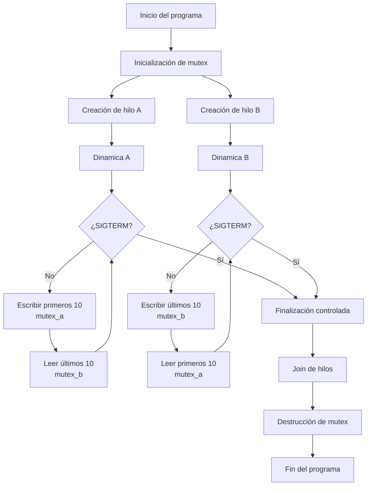
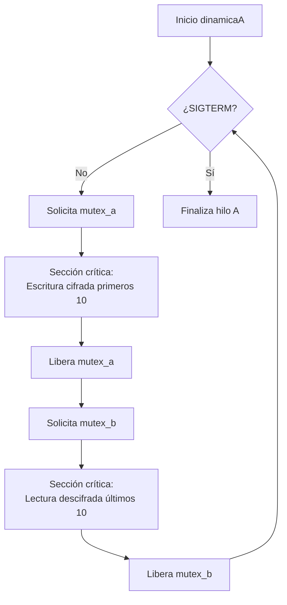

# Posix-Threads-Mutex-Sync

## Sistema Multihilo en C con Sincronización mediante Mutex y Manejo de Señales POSIX

Implementación de un sistema concurrente en C bajo el estándar POSIX Threads (`pthreads`).  
El proyecto demuestra sincronización controlada entre hilos mediante exclusión mutua (`mutex`), protocolo de lectura/escritura alternada sobre memoria compartida intra-proceso, cifrado modular de datos y finalización limpia mediante señales del sistema.


---

## Autor

Adriano Scatena  

---

## Índice

1. [Descripción General](#descripción-general)  
2. [Arquitectura del Sistema](#arquitectura-del-sistema)  
3. [Resolución Técnica y Modelo de Sincronización](#resolución-técnica-y-modelo-de-sincronización)  
4. [Modelo Criptográfico Implementado](#modelo-criptográfico-implementado)  
5. [Manejo de Señales y Finalización Controlada](#manejo-de-señales-y-finalización-controlada)  
6. [Diagrama de Flujo General](#diagrama-de-flujo-general)  
7. [Diagrama de Dinámica del Hilo A](#diagrama-de-dinámica-del-hilo-a)  
8. [Compilación y Ejecución](#compilación-y-ejecución)  
9. [Consideraciones Técnicas](#consideraciones-técnicas)  
10. [Bibliografía](#bibliografía)  

---

## Descripción General

El programa implementa un arreglo compartido de 20 enteros accesible por dos hilos concurrentes:

- **Hilo A**
- **Hilo B**

El comportamiento del sistema sigue un protocolo determinístico:

- Hilo A escribe los primeros 10 elementos.
- Hilo B los lee únicamente cuando la escritura finaliza.
- Hilo B escribe los últimos 10 elementos.
- Hilo A los lee únicamente cuando la escritura finaliza.
- El ciclo se repite hasta que el hilo A recibe la señal `SIGTERM`.

Restricción central del diseño:

> Ningún hilo puede sobrescribir su zona hasta que el otro haya leído completamente los datos, excepto en la primera iteración.

---

## Arquitectura del Sistema

### Componentes principales

- Estructura `shared_memory` con arreglo de 20 enteros.
- Dos hilos creados mediante `pthread_create()`.
- Dos mutex independientes:
  - `mutex_a` → protege los primeros 10 elementos.
  - `mutex_b` → protege los últimos 10 elementos.
- Variables de control compartidas:
  - `lectA`
  - `lectB`
  - `sigterm`
  - `sigstop`
  - `sigcont`

Al tratarse de hilos dentro del mismo proceso, la memoria es compartida directamente (mismo espacio de direcciones), por lo que no se requiere IPC a nivel kernel.

---

## Resolución Técnica y Modelo de Sincronización

La sincronización del sistema se implementa mediante `mutex` (Mutual Exclusion), mecanismo fundamental en programación concurrente que garantiza que únicamente un hilo pueda acceder a una sección crítica en un momento dado.

El diseño evita condiciones de carrera en la escritura y lectura del arreglo compartido, ya que ambos hilos operan sobre una estructura común de memoria. Sin un mecanismo de exclusión mutua, podrían producirse inconsistencias de datos debido a accesos simultáneos.

### Estrategia de sincronización

Cada hilo administra su acceso a la sección crítica del siguiente modo:

1. Solicita el bloqueo del `mutex` correspondiente.
2. Si el `mutex` está disponible, lo adquiere y ejecuta la sección crítica.
3. Si el `mutex` está ocupado, el hilo entra en estado de bloqueo a nivel del sistema operativo (bloqueo de sincronización).
4. Finalizada la sección crítica, el hilo libera el `mutex`.

Este comportamiento se implementa mediante:

- `pthread_mutex_lock()`
- `pthread_mutex_trylock()`
- `pthread_mutex_unlock()`

Ejemplo representativo (escritura del Hilo A):

```c
pthread_mutex_lock(&mutex_a);

printf("\nHilo A comenzó a escribir los primeros 10 elementos\n\n");

/* SECCIÓN CRÍTICA */
for (int i = 0; i < SIZE / 2; i++) {
    int rnum = rand() % 27;
    shm.datos[i] = cifrar(rnum);
    sleep(1);
}
/* FIN SECCIÓN CRÍTICA */

pthread_mutex_unlock(&mutex_a);
```

Mientras un hilo posee el `mutex`, ningún otro puede acceder a esa zona protegida.  
Cuando otro hilo intenta bloquear un `mutex` ya adquirido, el sistema operativo lo suspende hasta su liberación, evitando consumo activo de CPU.

Este esquema garantiza:

- Coherencia de datos
- Acceso ordenado
- Ausencia de condiciones de carrera
- Alternancia controlada entre escritura y lectura

---

## Modelo Criptográfico Implementado

Los valores generados pertenecen al rango `[0, 26]`, representando letras del alfabeto.

### Función de cifrado

f(x) = (4x + 5) mod 27

### Función inversa de descifrado

f⁻¹(x) = (7x + 19) mod 27

Implementación:

```c
int cifrar(int x) { return (4 * x + 5) % 27; }
int descifrar(int x) { return (7 * x + 19) % 27; }
```

Se trata de un cifrado afín modular clásico, donde las constantes cumplen la condición de inversibilidad en módulo 27.

El cifrado se realiza antes de escribir en memoria compartida, y el descifrado al momento de la lectura.

---

## Manejo de Señales y Finalización Controlada

La finalización del sistema se realiza mediante recepción de la señal `SIGTERM` en el hilo A:

```c
signal(SIGTERM, handle_sigterm);
```

El manejador:

```c
void handle_sigterm(int signum) {
    sigterm = true;
}
```

Al activarse:

- Se modifica una bandera compartida.
- Ambos hilos abandonan su bucle `while(!sigterm)`.
- Cada hilo finaliza mediante `pthread_exit(NULL)`.

El proceso principal sincroniza la finalización usando:

```c
pthread_join(hiloA, NULL);
pthread_join(hiloB, NULL);
```

Luego destruye los mutex:

```c
pthread_mutex_destroy(&mutex_a);
pthread_mutex_destroy(&mutex_b);
```

Este diseño garantiza:

- Terminación ordenada
- Liberación correcta de recursos
- Ausencia de hilos huérfanos
- Limpieza completa del entorno concurrente

---

## Diagrama de Flujo General



---

## Diagrama de Dinámica del Hilo A



---

## Compilación y Ejecución

### Compilación

```bash
gcc main.c -o posix_threads_sync -pthread
```

### Ejecución

```bash
./posix_threads_sync
```

### Envío de señales

Desde otra terminal:

```bash
kill -SIGTERM <PID>
kill -SIGUSR1 <PID>
kill -SIGUSR2 <PID>
```

El PID se muestra al iniciar el programa.

---

## Consideraciones Técnicas

Este proyecto evidencia:

- Dominio de programación concurrente en C.
- Comprensión del modelo de memoria compartida.
- Uso correcto de exclusión mutua en entornos POSIX.
- Interacción entre señales asincrónicas y ejecución multihilo.
- Finalización limpia y controlada de recursos compartidos.
- Modelado determinístico de protocolos de acceso a memoria.

---

## Bibliografía

1. IBM Documentation — Exclusión mutua y hebras  
   https://www.ibm.com/docs/es/i/7.5?topic=threads-mutexes  

2. pthread_join en C  
   https://www.delftstack.com/es/howto/c/pthread_join-return-value-in-c/  

3. IEEE Std 1003.1-2017 — POSIX Threads Standard  
